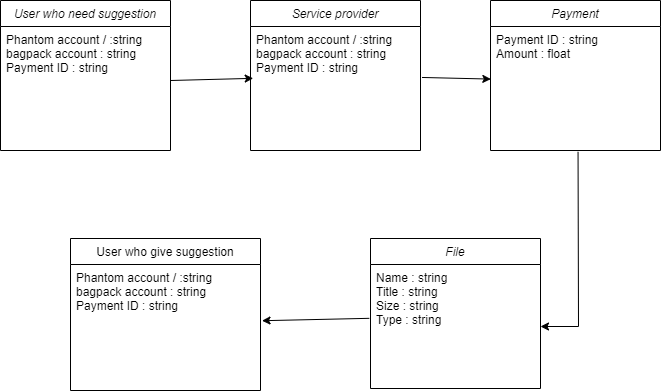
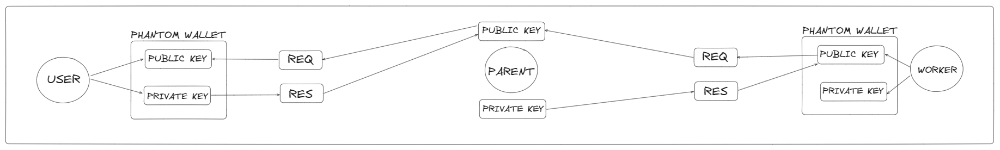

# **PicPayPoll**

    <em>The project aims to develop a decentralized full stack application with Web3 integration for data labeling and crowdsourced tasks. The platform will enable users to upload thumbnail images, set voting parameters, process payments using Solana, and facilitate public voting and reward distribution.</em>

---

# **Workflow**

> It is a basic workflow data flow diagram made for our project...

> It is a basic diagram of how the transaction takes place in our project...

#

# 💭**Inspiration**

Certainly, here are the key points outlining the inspiration behind PicPayPoll :

- Decentralization and Transparency:

  - The inspiration to use blockchain technology, specifically Solana, stems from the desire to leverage its decentralized nature. This ensures that voting and payment processes are transparent, secure, and tamper-proof. Decentralized applications (dApps) offer greater trust and security, reducing the risk of manipulation and fraud.

- Crowdsourcing and Community Involvement:

  - The idea of engaging the public in voting and reward distribution highlights the value of community participation. Crowdsourcing tasks and rewarding participation can lead to more accurate and diverse inputs, enhancing the quality of data labeling. This democratic approach empowers users and voters alike.

- Web3 Integration:

  - Integrating Web3 technologies allows for a modern, cutting-edge application that appeals to tech-savvy users and developers. The use of web3.js for blockchain interactions enables seamless integration with decentralized networks, making the platform future-proof and aligned with the latest technological trends.

- Efficient Storage Solutions:

  - Utilizing Amazon S3 for thumbnail storage is inspired by the need for a scalable, reliable, and cost-effective storage solution. S3’s pre-signed URLs ensure secure and efficient file uploads, enhancing user experience.

- Innovation in Payment Processing:

  - Implementing Solana for payment processing is inspired by the need for fast, low-cost, and scalable blockchain transactions. Solana’s high performance supports real-time interactions, making it suitable for handling numerous transactions efficiently.

- Empowering Creators and Contributors:

  - By allowing users to upload content and set voting parameters, the platform empowers creators to engage with their audience directly. The reward system incentivizes participation, creating a mutually beneficial ecosystem for both content creators and contributors.

- Addressing Modern Needs:
  - The project addresses current trends and needs in data labeling, blockchain integration, and decentralized applications. It aims to provide a solution that is not only technologically advanced but also practical and aligned with contemporary demands for security, transparency, and community involvement.

#

# **What problem does the project solve?**

- Lack of Transparency in Voting and Reward Systems:

  - Traditional platforms for voting and reward distribution often suffer from a lack of transparency, leading to potential fraud and manipulation. By leveraging blockchain technology, this project ensures that all voting and payment transactions are transparent, secure, and immutable.

- Centralized Control and Trust Issues:

  - Centralized systems require users to place trust in a single entity, which can be a point of failure or corruption. This project decentralizes control, providing a trustless environment where all actions are verifiable on the blockchain, thus eliminating the need for a central authority.

- Inefficient Payment Processing:

  - Conventional payment systems can be slow and expensive, especially for international transactions. Using Solana for payment processing offers fast, low-cost transactions, making it efficient for users to set up voting tasks and distribute rewards.

- Scalability Issues with Traditional Storage Solutions:

  - Handling large volumes of data and ensuring secure, scalable storage can be challenging. By utilizing Amazon S3 for storing thumbnails, the project provides a scalable, reliable, and cost-effective storage solution.

- Engagement and Incentivization Challenges:

  - Engaging users and incentivizing participation can be difficult. This project encourages public voting by offering rewards, thereby increasing user engagement and ensuring a more active and motivated community.

- Complexity in Setting Up Voting Parameters:

  - Setting up and managing voting parameters can be complex and error-prone in traditional systems. The project simplifies this process, allowing users to easily define and manage voting parameters for their tasks.

- Security Concerns in Data Transfer:

  - Ensuring secure data transfer and storage is a major concern. The project addresses this by using HTTPS for secure communication and Amazon S3’s pre-signed URLs for secure file uploads.

- Usability and Performance Bottlenecks:

  - Many existing platforms struggle with usability and performance issues, particularly under high load. The project uses Next.js for the frontend, ensuring a smooth, responsive, and efficient user interface, capable of handling multiple concurrent users effectively.

- Difficulty in Ensuring Fair Reward Distribution:

  - Distributing rewards fairly and accurately can be problematic. By recording all votes and payments on the blockchain, the project ensures that rewards are distributed transparently and fairly based on verifiable actions.

#

# **Built With**

   

#

# **Use This Project**

If you'd like to run this project on your local machine, please read our [USE GUIDE](https://github.com/0LEUM/PicPayPoll/blob/main/USE.md)

#

# **Hall of Fame** ✨

 

